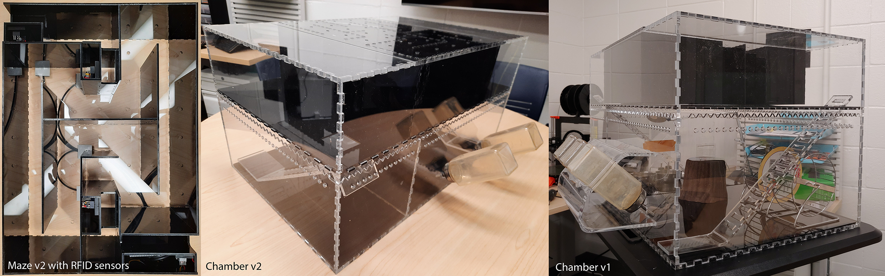
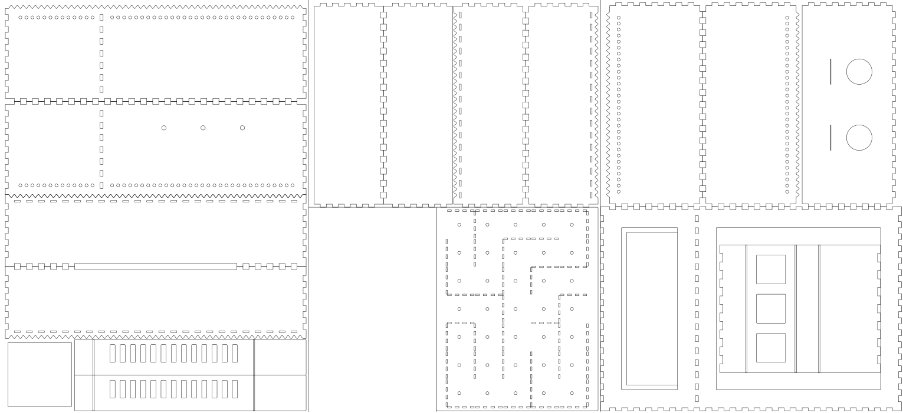

# Enrichment chamber
CAD files and assembly instructions for an enrichment chamber with optional RFID sensors. 
All the floors, the ladders, and the mazes are removable. 
Required CAD files for laser cutting are provided. 
Optional code to create the CAD files programmatically (including option to adjust the kerf) is provided in `main.m`. 
Mazes can be designed with simple text instructions (see 6 examples at the end of `main.m`). 

See related resources:
- [CAD library][cad-library]

## Components
- [6mm clear acrylic sheets](https://www.polymershapes.com/product/acrylic/)
- [3mm black acrylic sheets](https://www.polymershapes.com/product/acrylic/)

## Assembly instructions
- Laser cut the acrylic sheets using the [provided CAD drawings](CAD). Remove protective film.
- Assemble all acrylic parts (except removable parts) using painter's tape and apply acrylic cement or 2-part epoxy.
- Remove painter's tape after drying.
- Heat the ladders at the folding lines of the drawing using a heat gun and bend to accomplish the shape shown in the pictures.

## Recreating CAD files programmatically
### Prerequisites
- [MATLAB][MATLAB] (last tested with R2023a)

### Installation
- Install [MATLAB][MATLAB]
- Download and extract the [CAD library][cad-library] to the `Documents/MATLAB` folder (see [the library's installation instructions][cad-library]).
- Download and extract the [project scripts][cad-scripts] to `Documents/MATLAB` folder.
- Edit sizes and maze designs and run `main.m`.

## RFID add-on
Optional RFID sensors can be used to track a subject navigating throught the maze.

### Components
- 1 x [Arduino Mega 2560 Rev 3](https://store.arduino.cc/products/arduino-mega-2560-rev3)
- 4 x [ID-12LA RFID sensors](https://www.mouser.ca/ProductDetail/SparkFun/SEN-11827?qs=WyAARYrbSnbkXY1Fl9rz%2Fw%3D%3D)
- 2 x [220uF electrolylic capacitors](https://www.mouser.ca/ProductDetail/KEMET/ESK227M016AE3EA?qs=sGAEpiMZZMsh%252B1woXyUXj7ZbELRZb3UPSAyYJhhF4U0%3D)
- [125Khz RFID tags](https://www.mouser.ca/ProductDetail/SparkFun/SEN-09416?qs=WyAARYrbSnYupkaxZp2N0w%3D%3D)
- [Shielded cable with 3 conductors](https://www.digikey.ca/en/products/detail/tensility-international-corp/30-00377/5270246)
- [Fuse Tape](https://www.amazon.ca/gp/product/B0018BVNIS)

### Software prerequisites
- [Python][Python] (last tested with Python 3.9)
- [PySerial](https://pyserial.readthedocs.io/en/latest/pyserial.html)

### Instructions
- Repeat assembly instructions above for the microcontroller and RFID sensor enclosures.
- Wire each RFID sensor according to the manufacturer [instructions](https://www.mouser.ca/datasheet/2/813/ID_2LA_2c_ID_12LA_2c_ID_20LA2013_4_10-2489776.pdf) for ASCII output (`Pin 2` to `VDC` and `Pin 7` to `GND`) and connect the data pin `D0` from each sensor to `RX1`, `RX2`, `RX3` and `A8` pins of the Arduino Mega. Insert RFID enclosures, the microcontroller and wired sensors through the holes of maze `z1`.
- Using fuse tape, attach the sensors to the bottom of each casing, facing the maze path, making sure they all face the same side. 
- Upload the [Arduino code][rfid-scripts] to the microcontroller using [Arduino IDE](https://www.arduino.cc/en/software)
- Connect the usb cable to the computer and monitor the outputs using a [serial monitor program](src/rfid/SerialCapture.py).

## Using Serial Capture
- Using python start the acquisition program with `python SerialCapture.py`
- Stop capturing by pressing `ctrl+c`
- Data is saved to the `Documents` folder as a `csv` file with the data and time encoded in the filename.

## Changelog
See [Changelog](CHANGELOG.md)

## License
© 2021 [Leonardo Molina][Leonardo Molina]

### License for the aparatus and CAD files
[Creative Commons BY-NC-SA 4.0 License][cad-license]

### License for the source code
[GNU GPLv3 License][code-license]

[cad-library]: https://github.com/leomol/cad
[cad-scripts]: src/CAD/
[rfid-scripts]: src/RFID/
[Leonardo Molina]: https://github.com/leomol
[MATLAB]: https://www.mathworks.com/downloads/
[Python]: https://www.python.org/downloads/
[code-license]: src/LICENSE.md
[cad-license]: CAD/LICENSE.md